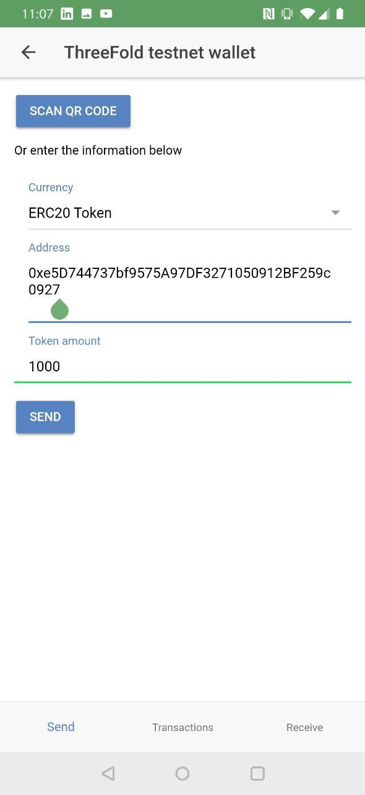
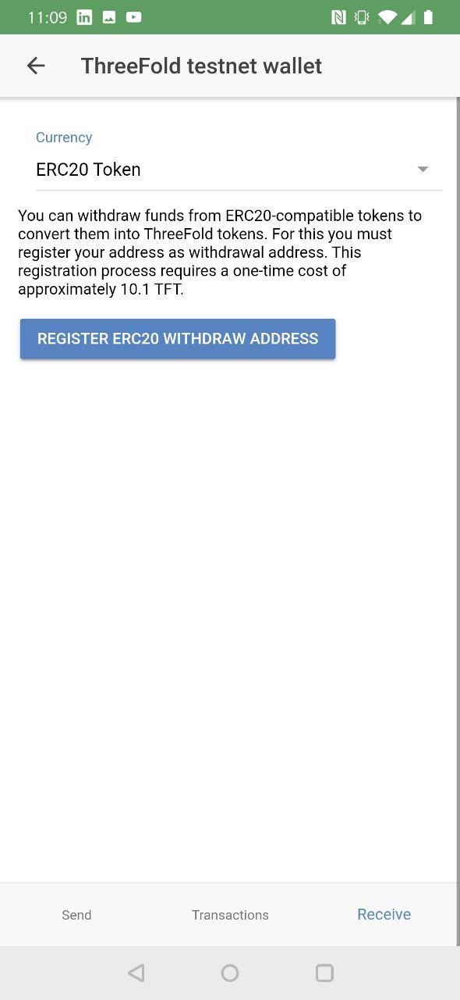
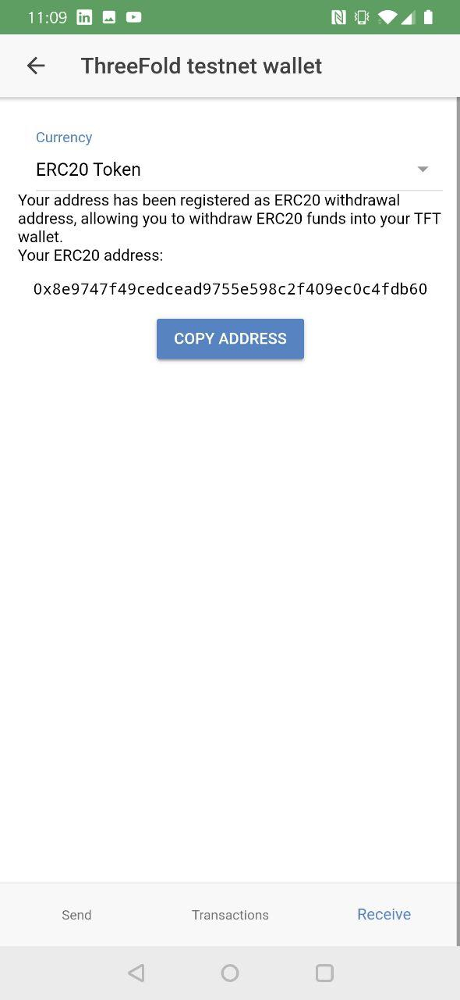
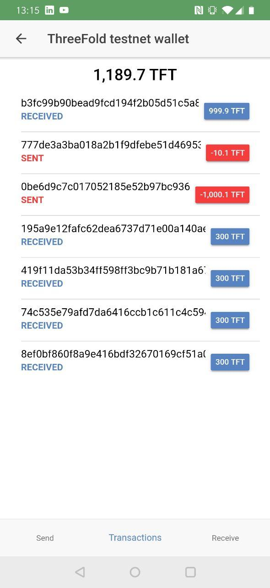

# TFT to ERC20 flow

In order to facilitate the exchange of threefold tokens, a bridge has been implemented which allows regular TFTs to be converted into an ERC20 compatible token.
This token can be traded / exchanged on the ethereum network (meaning gas is required to transfer it). After this, the reverse operation is also possible, converting
these ERC20 compatible tokens back to regular TFTs.

## Contract addresses

The contract addresses which implement the ERC20 token (and thus are needed to view your ERC20 tokens) are as follows:

- Standard net contract (Mainnet): `TBD`
- Testnet contract (Ropsten): `0xb821227dBa4Ef9585D31aa494406FD5E47a3db37`

## Converting TFTs to ERC20 compatible tokens

To convert TFTs to the ERC20 tokens, you will need at least 1,000 TFT (+0.1 TFT to pay the transaction fee), and the ethereum address to send the tokens to (e.g. through metamask). Once you have this, you can convert your tokens by simply sending your TFT to this address. After the transaction has been mined in a block,
6 more blocks are waited before the ERC20 tokens will be minted onto the account. This provided protection against small forks on the tfchain network.

## Registering a withdrawal address

To withdraw ERC20 tokens to a TFT address, you need to register a withdrawal address for your wallet. A withdrawal address is created for you after you create
the corresponding transaction. The address generated is based on a public key you own, and is thus linked to your wallet. This also means that a withdrawal address
is linked to an actual TFT address, which will eventually receive any tokens transfered to the ERC20 address.

## Converting ERC20 compatible tokens back to TFTs

Finally, ERC20 tokens can be converted back to TFTs, in roughly the same way as they were originally created, but with a transaction on the ethereum network. As mentioned in the previous section, you will need to have registered a withdrawal address in order to withdraw your tokens again. Converting your tokens is as simple
as creating an ethereum transaction, where you send the amount of tokens you want to convert to the withdrawal address. After 30 ethereum blocks, to guard against
forks on the ethereum network, a transaction is created on the tfchain network which transfers the same amount back to your TFT address. Unlike the TFT to ERC20 conversion, there is no minimum amount required to do the conversion.

An example of how you wallet could look after gettings some TFT, sending them to an ethereum wallet, registering a withdrawal address and finaly sending the funds back to your wallet:

